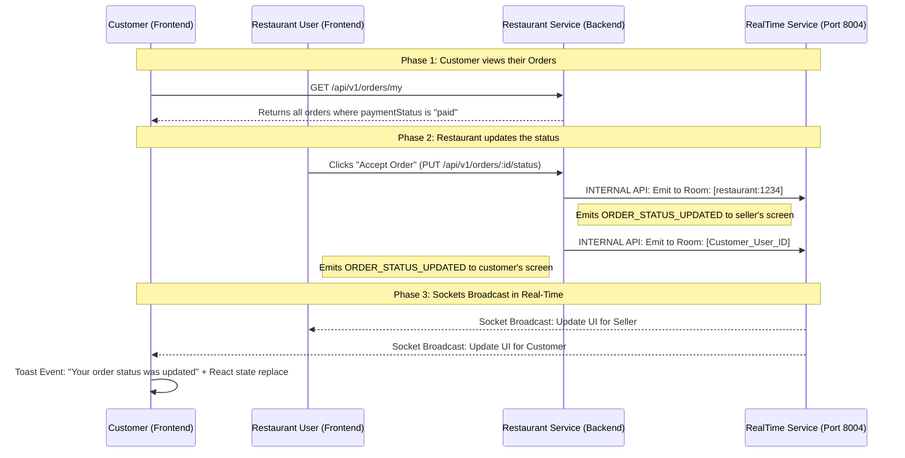

# 🚀 Real-Time Customer & Seller Orders Flow

This document explains the exact end-to-end flow of how an Order starts at checkout, reaches the Restaurant, and how real-time Socket.io updates are synced between the Seller and the Customer.

---

## 🏗️ 1. The Real-Time Architecture (How it works)

We utilize an isolated internal **RealTime Service (Port 8004)** ecosystem to safely bounce events from the Restaurant Backend to both the Customer and Seller frontends instantly.

## 📂 2. Frontend Component Roles

### A. Reusable `OrderCard.tsx`
Instead of writing the complex HTML twice, we built the `OrderCard` to be smart.
- **For Sellers (`RestaurantOrders.tsx`)**: We pass an `onUpdateStatus` function to the component. Because it receives this function, it renders the functional "Accept Order" or "Ready for Rider" buttons.
- **For Customers (`Orders.tsx`)**: We purposely do **not** pass the `onUpdateStatus` function. The component detects this and automatically hides the buttons, acting purely as a beautiful display card.

### B. The Customer Page (`Orders.tsx`)
- **Data Initialization**: The moment the page loads, it runs `fetchMyOrders()` to grab the history from the database.
- **WebSockets Background Listener**: Using `const { socket } = useSocket();`, it silently registers a listener for the `"ORDER_STATUS_UPDATED"` event. 
- **Dynamic Updates**: If an event flies in while the user is staring at the page, React intercepts the payload, maps through the active order list, and replaces the old status (e.g. `placed`) with the new one (e.g. `preparing`) instantly.

## ⚙️ 3. Backend Logic Roles

### `backend/restaurant/src/controllers/order.controller.ts`
When the seller presses "Update Status", it triggers the `updateOrderStatus` controller block.
Once the MongoDB `Order` document is successfully updated and saved, the backend manually acts as a client sending two `axios.post()` webhooks:

1. **Webhook 1**: Targets the `restaurant:ID` room. This ensures whether the restaurant owner is on their phone, tablet, or laptop, all of their devices update simultaneously.
2. **Webhook 2**: Targets the `userId` room (the customer's isolated room). This ensures the customer gets a live notification on their specific device. 

**Security Note:** Because these notifications use a strictly safeguarded backend channel (`x-internal-key`), it's impossible for malicious users to send fake push notifications into the architecture.  
